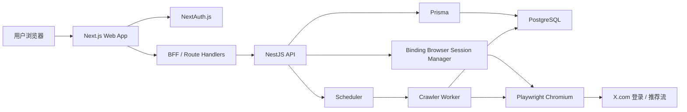
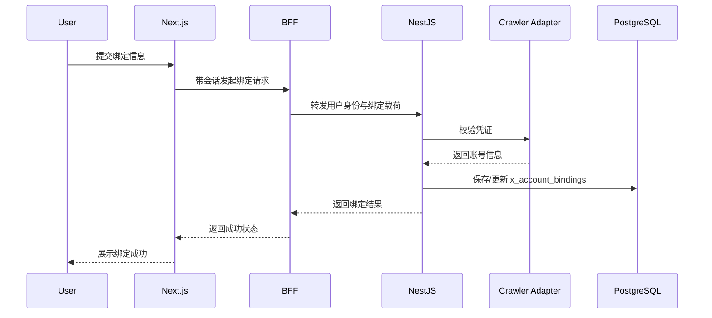
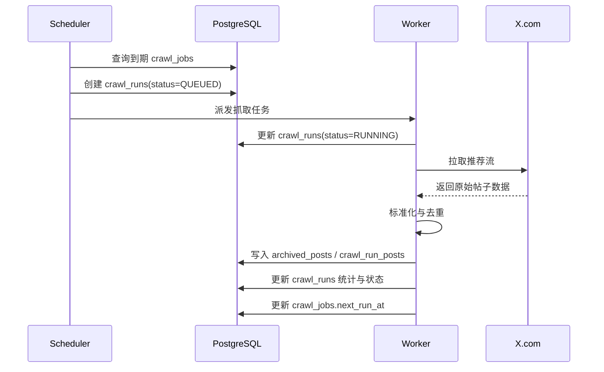
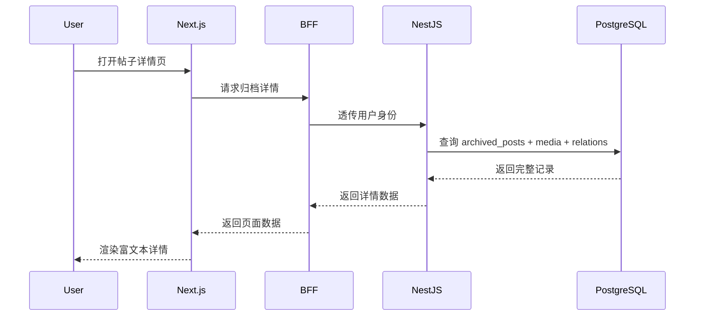
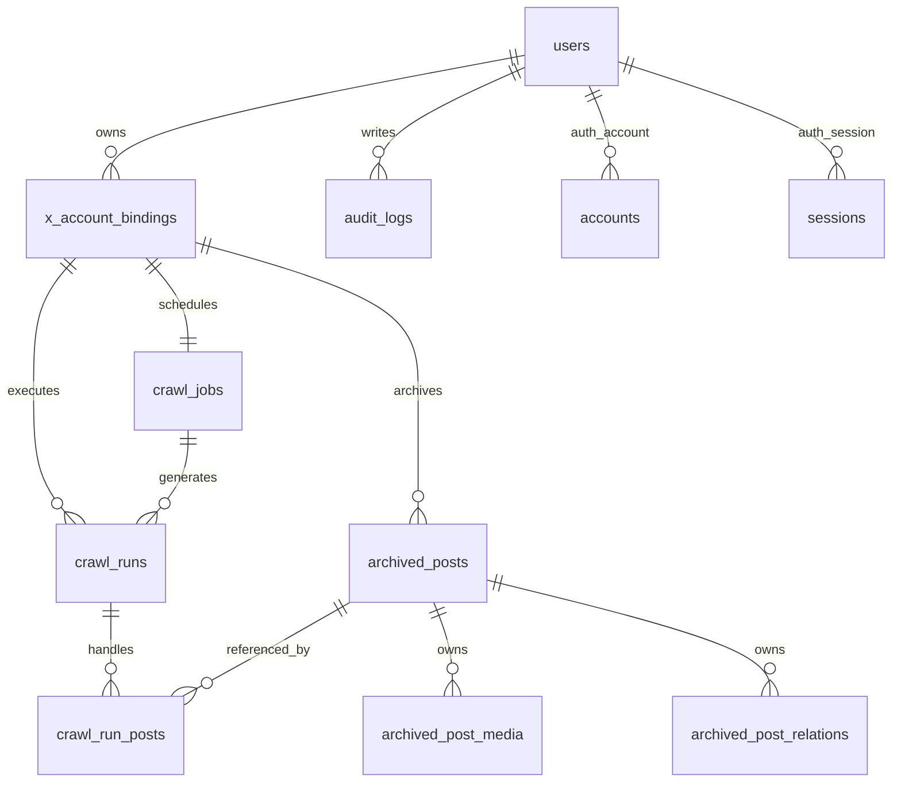
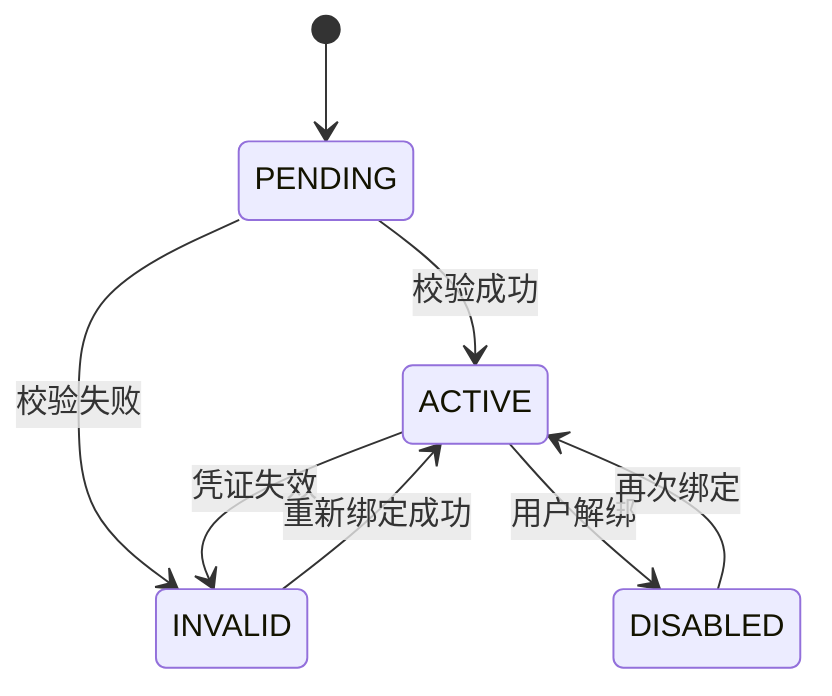
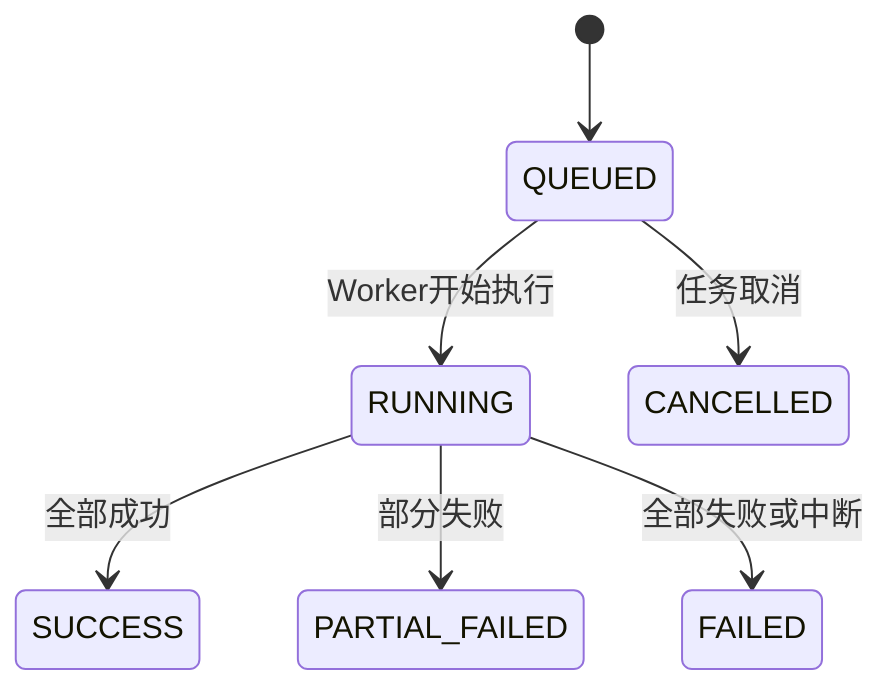

# X 推荐内容抓取与归档平台详细设计文档

## 1. 文档说明

- 文档状态：更新中
- 更新时间：2026-03-19
- 关联文档：`docs/需求文档.md`
- 适用阶段：MVP 第一阶段
- 文档目标：将需求文档细化为可实现的系统设计，覆盖架构设计、功能设计、数据模型、实体关系模型、接口设计和关键流程

## 2. 设计目标与边界

### 2.1 设计目标

1. 支持用户登录平台并绑定一个可用的 X 账号。
2. 支持系统定时抓取该账号推荐流内容，并记录每次抓取执行结果。
3. 支持按“绑定账号 + 帖子 ID”去重归档，避免重复入库。
4. 支持将帖子转换为富文本并在系统内长期存档。
5. 支持帖子卡片列表分页展示、详情查看和任务记录追踪。

### 2.2 非目标

1. 本阶段不包含自动发布到微信公众号。
2. 本阶段不包含多人协作、审批流和组织空间。
3. 本阶段不包含面向第三方的开放 API。
4. 本阶段不包含复杂内容编辑器，仅提供富文本归档展示。

### 2.3 关键设计假设

1. 前端采用 Next.js，负责页面渲染、用户会话和 BFF 层认证转发。
2. 后端采用 NestJS，负责业务 API、任务调度、抓取执行、归档处理和数据访问。
3. 数据库使用 PostgreSQL，ORM 使用 Prisma。
4. 认证基于 NextAuth.js，用户体系与业务数据共用同一 PostgreSQL。
5. X 推荐流抓取依赖登录态，因此系统使用可插拔的“浏览器辅助绑定 + 抓取适配器”设计。
6. 生产部署推荐为“Next.js on Vercel + NestJS Worker/API on Docker + PostgreSQL on Neon”。

## 3. 总体架构设计

### 3.1 逻辑架构



### 3.2 分层说明

1. 表现层：Next.js 页面、ShadCN UI 组件、Tailwind CSS 样式、客户端状态管理。
2. 接入层：Next.js Middleware 与 Route Handlers，负责会话校验、BFF 转发和页面保护。
3. 业务层：NestJS 的绑定管理、浏览器绑定会话管理、抓取调度、归档管理、任务记录、仪表盘统计模块。
4. 数据层：Prisma + PostgreSQL，保存认证数据、业务实体、任务记录、归档内容和审计信息。
5. 异步执行层：NestJS Scheduler 或队列 Worker，负责定时扫描、抓取执行、解析和落库。

### 3.3 技术决策

#### 3.3.1 认证与权限

1. NextAuth.js 负责用户登录、会话维持与页面访问保护。
2. Next.js 服务端在获取到登录会话后，将当前用户身份通过内部受信方式传递给 NestJS。
3. NestJS 仅信任来自受控 BFF 的内部请求头或内部签名 Token，不直接暴露匿名业务接口。

#### 3.3.2 抓取执行

1. 定时扫描由 NestJS 负责，避免将长任务放在 Vercel Serverless 中执行。
2. 抓取过程拆分为“任务选择 -> 抓取执行 -> 标准化解析 -> 去重写入 -> 结果汇总”五个阶段。
3. 抓取适配器采用接口抽象，方便后续替换为不同实现方式。

#### 3.3.3 去重策略

1. 数据库层通过 `unique(binding_id, x_post_id)` 做强约束。
2. 业务层在写入前先查询，写入时再依赖唯一约束兜底，保证并发场景下仍不会重复。
3. 每次抓取无论新增还是跳过，都会生成对应的处理记录。

#### 3.3.4 富文本归档

1. 归档主数据保存原始文本、结构化富文本 JSON、渲染后 HTML 和原始载荷 JSON。
2. 前端优先使用结构化 JSON 渲染，HTML 作为降级展示或调试用途。
3. 所有 HTML 内容必须经过服务端清洗，防止 XSS。

## 4. 模块设计

### 4.1 用户登录与权限模块

#### 4.1.1 目标

1. 提供稳定的登录能力。
2. 保护系统内需要登录后访问的页面和接口。
3. 让用户与绑定账号、任务记录、归档内容形成清晰的数据隔离。

#### 4.1.2 前端设计

1. 页面路径：`/login`
2. 组件组成：登录卡片、登录方式入口、错误提示、登录中状态
3. 受保护页面：`/dashboard`、`/bindings`、`/archives`、`/runs`
4. 未登录访问受保护页面时，Next.js Middleware 重定向到登录页

#### 4.1.3 后端设计

1. NestJS 不单独维护登录页。
2. NestJS 接收由 BFF 透传的用户身份，例如 `x-user-id`、`x-user-role` 和内部签名头。
3. 所有业务查询必须带 `userId` 过滤条件，禁止依赖前端传入的任意用户 ID。

#### 4.1.4 权限规则

1. 用户只能读取和修改自己的绑定账号。
2. 用户只能查看自己的抓取任务与归档内容。
3. 管理员角色暂时只做数据模型预留，不在 MVP 页面开放。

### 4.2 X 账号绑定模块

#### 4.2.1 目标

1. 建立平台用户与 X 账号之间的绑定关系。
2. 持久化保存抓取所需的最小凭证集合。
3. 支持绑定状态校验、失效标记和重新绑定。

#### 4.2.2 页面设计

页面路径：`/bindings`

页面结构：

1. 当前绑定卡片
2. 绑定状态展示区
3. 浏览器辅助绑定入口
4. 浏览器绑定会话状态区
5. 抓取配置表单
6. “立即抓取”按钮
7. 重新校验按钮
8. 解绑按钮

空状态：

1. 未绑定时展示“通过浏览器登录并绑定 X 账号”主按钮
2. 展示绑定说明、风险提示和最小权限说明

#### 4.2.3 交互流程

1. 用户点击“通过浏览器登录并绑定 X 账号”。
2. 后端创建浏览器绑定会话，并在本机拉起 Playwright Chromium 可视窗口。
3. 浏览器自动跳转到 `https://x.com/i/flow/login`。
4. 用户在该窗口内手动完成登录。
5. 前端轮询绑定会话状态。
6. 后端检测到登录成功后，自动提取 Cookie、`auth_token`、`ct0` 和当前账号基础信息。
7. 后端调用绑定服务创建或更新绑定记录。
8. 系统返回绑定成功状态与基础账号信息。

#### 4.2.4 状态设计

绑定状态 `BindingStatus`：

1. `PENDING`：已提交凭证，尚未完成校验
2. `ACTIVE`：校验通过，可执行抓取
3. `INVALID`：凭证失效或校验失败
4. `DISABLED`：用户主动停用或解绑

#### 4.2.5 业务规则

1. MVP 默认每个用户仅允许一个激活中的绑定账号。
2. 若再次绑定，则覆盖原有激活绑定或先将原绑定置为 `DISABLED`。
3. 绑定凭证必须加密后再保存。
4. 每次抓取失败若判断为凭证失效，需回写 `INVALID` 状态。
5. 浏览器绑定会话默认 10 分钟超时，超时后需重新发起。

### 4.3 抓取配置与调度模块

#### 4.3.1 目标

1. 支持自动抓取和手动抓取两种触发方式。
2. 支持定时扫描到期任务并创建抓取执行记录。
3. 保证同一绑定账号在同一时刻只有一个运行中的任务。

#### 4.3.2 页面设计

抓取配置位于 `/bindings` 页面内，字段包括：

1. 自动抓取开关 `crawlEnabled`
2. 抓取周期 `crawlIntervalMinutes`
3. 最近抓取时间 `lastCrawledAt`
4. 下一次执行时间 `nextCrawlAt`

#### 4.3.3 调度设计

1. NestJS Scheduler 每分钟扫描一次到期任务。
2. 查询条件：`crawl_enabled = true` 且 `next_crawl_at <= now()`
3. 调度层使用数据库锁或业务锁防止重复领取任务。
4. 任务被领取后创建一条 `crawl_runs` 记录，状态置为 `QUEUED`
5. Worker 开始执行后将状态更新为 `RUNNING`

#### 4.3.4 并发控制

1. 同一 `binding_id` 同时只允许一个 `RUNNING` 或 `QUEUED` 任务。
2. 并发控制采用以下组合策略：调度查询使用 `FOR UPDATE SKIP LOCKED`、`crawl_jobs` 表维护 `lastRunAt` 和 `nextRunAt`、Worker 启动时再次校验是否已有运行中任务。

#### 4.3.5 下一次执行时间计算

1. 成功执行后：`nextRunAt = now() + intervalMinutes`
2. 部分失败后：仍按正常周期推进，但记录错误摘要
3. 账号失效时：暂停自动抓取，并将 `nextRunAt` 置空

### 4.4 抓取执行模块

#### 4.4.1 目标

1. 从 X 推荐流中拉取帖子原始数据。
2. 将原始结果标准化为内部统一结构。
3. 对每一条帖子执行去重判断与归档。

#### 4.4.2 执行步骤

1. 读取绑定凭证并解密。
2. 初始化抓取适配器实例。
3. 通过 Playwright 创建带登录态 Cookie 的浏览器上下文。
4. 打开 `https://x.com/home` 并等待推荐流内容渲染。
5. 抓取当前可见推荐流帖子 DOM，构造成原始帖子数组。
6. 对响应内容进行标准化，得到统一 `NormalizedPost` 列表。
7. 逐条写入 `crawl_run_posts` 处理记录。
8. 新帖子写入归档表，已存在帖子标记为 `SKIPPED`。
9. 汇总本次执行结果并更新 `crawl_runs`。

#### 4.4.3 适配器接口

抓取适配器建议抽象为以下接口：

```ts
interface FeedCrawlerAdapter {
  validateCredential(payload: EncryptedCredential): Promise<BindingProfile>;
  fetchRecommendedFeed(payload: EncryptedCredential): Promise<RawFeedResponse>;
  normalizePosts(raw: RawFeedResponse): Promise<NormalizedPost[]>;
}
```

真实适配器补充设计：

1. `validateCredential`：用登录态 Cookie 打开 `x.com/home`，确认未跳转回登录流程。
2. `fetchRecommendedFeed`：抓取 `article[data-testid="tweet"]` 等可见 DOM 节点并提取帖子结构。
3. 绑定阶段登录窗口使用 `headless: false`，抓取阶段默认使用 `headless: true`。
4. 若部署环境没有可视桌面，浏览器辅助绑定流程需要配套远程桌面、VNC 或远程浏览器方案。

#### 4.4.4 `NormalizedPost` 统一结构

```ts
type NormalizedPost = {
  xPostId: string;
  postUrl: string;
  postType: "POST" | "REPOST" | "QUOTE" | "REPLY";
  author: {
    xUserId?: string;
    username: string;
    displayName?: string;
    avatarUrl?: string;
  };
  rawText: string;
  sourceCreatedAt: string;
  entities: {
    mentions: Array<{ username: string; start: number; end: number }>;
    hashtags: Array<{ tag: string; start: number; end: number }>;
    urls: Array<{ url: string; displayUrl?: string; start: number; end: number }>;
  };
  media: Array<{
    mediaType: "IMAGE" | "VIDEO" | "GIF";
    sourceUrl: string;
    previewUrl?: string;
    width?: number;
    height?: number;
    durationMs?: number;
  }>;
  relations: Array<{
    relationType: "QUOTE" | "REPOST" | "REPLY";
    targetXPostId?: string;
    targetUrl?: string;
    targetAuthorUsername?: string;
  }>;
  rawPayload: unknown;
};
```

### 4.5 去重与归档模块

#### 4.5.1 目标

1. 保证相同帖子不会被重复归档。
2. 保留每次抓取对帖子做出的处理结果。
3. 将帖子转换为系统统一的富文本结构。

#### 4.5.2 去重逻辑

1. 根据 `bindingId + xPostId` 查询是否存在归档记录。
2. 若不存在，则创建 `archived_posts` 主记录与关联媒体、关联关系记录。
3. 若存在，则本次 `crawl_run_posts` 标记为 `SKIPPED`，原因写入 `already_archived`。
4. 若并发写入时发生唯一约束冲突，则按已存在处理。

#### 4.5.3 富文本转换设计

内部统一富文本结构建议如下：

```json
{
  "version": 1,
  "blocks": [
    {
      "type": "paragraph",
      "children": [
        {
          "type": "text",
          "text": "示例文本"
        },
        {
          "type": "mention",
          "text": "@openai",
          "username": "openai"
        },
        {
          "type": "link",
          "text": "https://x.com",
          "href": "https://x.com"
        }
      ]
    },
    {
      "type": "media",
      "mediaRef": "media_1"
    }
  ]
}
```

#### 4.5.4 转换规则

1. 文本按段落和换行拆分。
2. `@提及` 转为 `mention` 节点。
3. `#标签` 转为 `hashtag` 节点。
4. 链接转为 `link` 节点。
5. 图片、视频、GIF 转为 `media` 块节点。
6. 引用帖、转发帖、回复关系转为 `relation` 摘要块。

#### 4.5.5 安全处理

1. `renderedHtml` 必须经过白名单清洗。
2. 原始文本与结构化 JSON 均保留，用于重建或重新渲染。
3. 不可信外链仅作为跳转目标，不内联执行第三方脚本。

### 4.6 归档浏览模块

#### 4.6.1 列表页设计

页面路径：`/archives`

页面区域：

1. 顶部筛选栏
2. 卡片列表区
3. 分页器
4. 空状态与错误状态

卡片字段：

1. 作者头像
2. 作者名与用户名
3. 帖子类型标签
4. 摘要文本
5. 媒体缩略图
6. 原始发布时间
7. 归档时间
8. 原文链接
9. 详情入口

#### 4.6.2 列表查询条件

1. `bindingId`
2. `keyword`
3. `postType`
4. `archivedFrom`
5. `archivedTo`
6. `page`
7. `pageSize`

#### 4.6.3 分页方案

1. MVP 使用页码分页，便于后台式页面实现。
2. 默认 `pageSize = 20`。
3. 后端返回 `total`、`page`、`pageSize`、`items`。

#### 4.6.4 详情页设计

页面路径：`/archives/[id]`

展示内容：

1. 作者信息
2. 帖子富文本全文
3. 媒体资源区
4. 帖子关系区
5. 原始来源信息
6. 首次归档任务信息

### 4.7 抓取记录模块

#### 4.7.1 页面设计

页面路径：`/runs`

列表字段：

1. 执行开始时间
2. 执行结束时间
3. 触发方式
4. 任务状态
5. 抓取总数
6. 新增数
7. 跳过数
8. 失败数
9. 错误摘要

#### 4.7.2 详情设计

页面路径：`/runs/[id]`

详情内容：

1. 任务基础信息
2. 绑定账号信息
3. 执行统计
4. 错误详情
5. 处理项列表

### 4.8 仪表盘模块

页面路径：`/dashboard`

展示内容：

1. 当前绑定账号状态
2. 最近一次抓取结果
3. 下一次抓取时间
4. 近 7 天抓取次数
5. 累计归档数量

## 5. 关键流程设计

### 5.1 绑定流程



### 5.2 定时抓取流程



### 5.3 归档详情查询流程



## 6. 接口设计

### 6.1 前端页面路由

1. `/login`：登录页
2. `/dashboard`：仪表盘
3. `/bindings`：X 账号绑定与抓取配置页
4. `/archives`：归档列表页
5. `/archives/[id]`：归档详情页
6. `/runs`：抓取记录页
7. `/runs/[id]`：抓取记录详情页

### 6.2 BFF 到 NestJS API 一览

| 方法 | 路径 | 说明 |
| --- | --- | --- |
| `GET` | `/api/dashboard/summary` | 获取仪表盘统计 |
| `GET` | `/api/bindings/current` | 获取当前用户绑定 |
| `POST` | `/api/bindings` | 创建或更新绑定 |
| `POST` | `/api/bindings/:id/validate` | 重新校验绑定 |
| `POST` | `/api/bindings/:id/disable` | 停用绑定 |
| `PATCH` | `/api/bindings/:id/crawl-config` | 更新抓取配置 |
| `POST` | `/api/bindings/:id/crawl-now` | 手动触发抓取 |
| `GET` | `/api/archives` | 获取归档分页列表 |
| `GET` | `/api/archives/:id` | 获取归档详情 |
| `GET` | `/api/runs` | 获取任务记录列表 |
| `GET` | `/api/runs/:id` | 获取任务记录详情 |

### 6.3 关键接口示例

#### 6.3.1 创建绑定

请求体：

```json
{
  "credentialSource": "WEB_LOGIN",
  "credentialPayload": "encrypted-or-raw-payload-from-collector",
  "crawlEnabled": true,
  "crawlIntervalMinutes": 60
}
```

返回体：

```json
{
  "id": "binding_xxx",
  "status": "ACTIVE",
  "username": "demo_user",
  "displayName": "Demo User",
  "avatarUrl": "https://...",
  "crawlEnabled": true,
  "crawlIntervalMinutes": 60,
  "nextCrawlAt": "2026-03-18T13:00:00.000Z"
}
```

#### 6.3.2 获取归档列表

查询参数：

```txt
page=1&pageSize=20&keyword=ai&postType=QUOTE
```

返回体：

```json
{
  "page": 1,
  "pageSize": 20,
  "total": 156,
  "items": [
    {
      "id": "post_001",
      "xPostId": "188888888888",
      "postType": "QUOTE",
      "authorUsername": "demo_user",
      "summaryText": "帖子摘要",
      "coverImage": "https://...",
      "sourceCreatedAt": "2026-03-18T10:20:00.000Z",
      "archivedAt": "2026-03-18T11:00:00.000Z"
    }
  ]
}
```

## 7. 数据库设计

### 7.1 实体清单

认证与用户实体：

1. `users`
2. `accounts`
3. `sessions`
4. `verification_tokens`

业务实体：

1. `x_account_bindings`
2. `crawl_jobs`
3. `crawl_runs`
4. `crawl_run_posts`
5. `archived_posts`
6. `archived_post_media`
7. `archived_post_relations`
8. `audit_logs`

### 7.2 实体关系模型



### 7.3 逻辑表设计

#### 7.3.1 `users`

| 字段 | 类型 | 约束 | 说明 |
| --- | --- | --- | --- |
| `id` | `text` | PK | 用户 ID |
| `name` | `text` | nullable | 用户名称 |
| `email` | `text` | unique, nullable | 邮箱 |
| `email_verified` | `timestamp` | nullable | 邮箱验证时间 |
| `image` | `text` | nullable | 头像 |
| `role` | `text` | not null | `USER` / `ADMIN` |
| `created_at` | `timestamp` | not null | 创建时间 |
| `updated_at` | `timestamp` | not null | 更新时间 |

#### 7.3.2 `x_account_bindings`

| 字段 | 类型 | 约束 | 说明 |
| --- | --- | --- | --- |
| `id` | `text` | PK | 绑定 ID |
| `user_id` | `text` | FK -> users.id | 所属用户 |
| `x_user_id` | `text` | not null | X 用户 ID |
| `username` | `text` | not null | X 用户名 |
| `display_name` | `text` | nullable | 显示名称 |
| `avatar_url` | `text` | nullable | 头像 |
| `status` | `text` | not null | 绑定状态 |
| `credential_source` | `text` | not null | 凭证来源 |
| `auth_payload_encrypted` | `text` | not null | 加密凭证 |
| `last_validated_at` | `timestamp` | nullable | 最近校验时间 |
| `crawl_enabled` | `boolean` | not null | 是否启用抓取 |
| `crawl_interval_minutes` | `integer` | not null | 抓取周期 |
| `last_crawled_at` | `timestamp` | nullable | 最近抓取时间 |
| `next_crawl_at` | `timestamp` | nullable | 下一次抓取时间 |
| `last_error_message` | `text` | nullable | 最近错误摘要 |
| `created_at` | `timestamp` | not null | 创建时间 |
| `updated_at` | `timestamp` | not null | 更新时间 |

索引建议：

1. `idx_x_account_bindings_user_id`
2. `idx_x_account_bindings_status`
3. `idx_x_account_bindings_next_crawl_at`

#### 7.3.3 `crawl_jobs`

| 字段 | 类型 | 约束 | 说明 |
| --- | --- | --- | --- |
| `id` | `text` | PK | 任务配置 ID |
| `binding_id` | `text` | FK, unique | 对应绑定账号 |
| `enabled` | `boolean` | not null | 是否启用 |
| `interval_minutes` | `integer` | not null | 周期 |
| `last_run_at` | `timestamp` | nullable | 最近执行时间 |
| `next_run_at` | `timestamp` | nullable | 下一次执行时间 |
| `created_at` | `timestamp` | not null | 创建时间 |
| `updated_at` | `timestamp` | not null | 更新时间 |

#### 7.3.4 `crawl_runs`

| 字段 | 类型 | 约束 | 说明 |
| --- | --- | --- | --- |
| `id` | `text` | PK | 执行记录 ID |
| `binding_id` | `text` | FK -> x_account_bindings.id | 所属绑定 |
| `crawl_job_id` | `text` | FK -> crawl_jobs.id | 来源任务配置 |
| `trigger_type` | `text` | not null | `MANUAL` / `SCHEDULED` / `RETRY` |
| `status` | `text` | not null | 执行状态 |
| `started_at` | `timestamp` | nullable | 开始时间 |
| `finished_at` | `timestamp` | nullable | 结束时间 |
| `fetched_count` | `integer` | not null | 抓取总数 |
| `new_count` | `integer` | not null | 新增数 |
| `skipped_count` | `integer` | not null | 跳过数 |
| `failed_count` | `integer` | not null | 失败数 |
| `error_message` | `text` | nullable | 错误摘要 |
| `error_detail` | `jsonb` | nullable | 错误详情 |
| `created_at` | `timestamp` | not null | 创建时间 |

索引建议：

1. `idx_crawl_runs_binding_id_created_at`
2. `idx_crawl_runs_status`

#### 7.3.5 `crawl_run_posts`

| 字段 | 类型 | 约束 | 说明 |
| --- | --- | --- | --- |
| `id` | `text` | PK | 处理项 ID |
| `crawl_run_id` | `text` | FK -> crawl_runs.id | 所属执行记录 |
| `x_post_id` | `text` | not null | 帖子 ID |
| `archived_post_id` | `text` | FK -> archived_posts.id, nullable | 归档引用 |
| `action_type` | `text` | not null | `CREATED` / `SKIPPED` / `FAILED` |
| `reason` | `text` | nullable | 结果原因 |
| `raw_payload_json` | `jsonb` | nullable | 单条原始载荷 |
| `created_at` | `timestamp` | not null | 创建时间 |

约束建议：

1. `unique(crawl_run_id, x_post_id)`

#### 7.3.6 `archived_posts`

| 字段 | 类型 | 约束 | 说明 |
| --- | --- | --- | --- |
| `id` | `text` | PK | 归档主键 |
| `binding_id` | `text` | FK -> x_account_bindings.id | 来源绑定 |
| `first_crawl_run_id` | `text` | FK -> crawl_runs.id, nullable | 首次归档任务 |
| `x_post_id` | `text` | not null | X 帖子 ID |
| `post_url` | `text` | not null | 原文链接 |
| `post_type` | `text` | not null | 帖子类型 |
| `archive_status` | `text` | not null | 归档状态 |
| `author_x_user_id` | `text` | nullable | 作者 X 用户 ID |
| `author_username` | `text` | not null | 作者用户名 |
| `author_display_name` | `text` | nullable | 作者显示名 |
| `author_avatar_url` | `text` | nullable | 作者头像 |
| `language` | `text` | nullable | 语言 |
| `raw_text` | `text` | not null | 原始文本 |
| `rich_text_json` | `jsonb` | not null | 富文本 JSON |
| `rendered_html` | `text` | nullable | 清洗后的 HTML |
| `raw_payload_json` | `jsonb` | not null | 原始载荷 |
| `source_created_at` | `timestamp` | not null | 原文发布时间 |
| `archived_at` | `timestamp` | not null | 归档时间 |
| `reply_count` | `integer` | nullable | 回复数 |
| `repost_count` | `integer` | nullable | 转发数 |
| `quote_count` | `integer` | nullable | 引用数 |
| `favorite_count` | `integer` | nullable | 点赞数 |
| `view_count` | `bigint` | nullable | 浏览数 |
| `created_at` | `timestamp` | not null | 创建时间 |
| `updated_at` | `timestamp` | not null | 更新时间 |

约束建议：

1. `unique(binding_id, x_post_id)`

索引建议：

1. `idx_archived_posts_binding_id_archived_at`
2. `idx_archived_posts_binding_id_source_created_at`
3. `idx_archived_posts_author_username`
4. `idx_archived_posts_post_type`

#### 7.3.7 `archived_post_media`

| 字段 | 类型 | 约束 | 说明 |
| --- | --- | --- | --- |
| `id` | `text` | PK | 媒体记录 ID |
| `archived_post_id` | `text` | FK -> archived_posts.id | 所属帖子 |
| `media_type` | `text` | not null | `IMAGE` / `VIDEO` / `GIF` |
| `source_url` | `text` | not null | 原始资源地址 |
| `preview_url` | `text` | nullable | 缩略图 |
| `width` | `integer` | nullable | 宽度 |
| `height` | `integer` | nullable | 高度 |
| `duration_ms` | `integer` | nullable | 时长 |
| `sort_order` | `integer` | not null | 排序 |
| `created_at` | `timestamp` | not null | 创建时间 |

#### 7.3.8 `archived_post_relations`

| 字段 | 类型 | 约束 | 说明 |
| --- | --- | --- | --- |
| `id` | `text` | PK | 关系记录 ID |
| `archived_post_id` | `text` | FK -> archived_posts.id | 所属帖子 |
| `relation_type` | `text` | not null | `QUOTE` / `REPOST` / `REPLY` |
| `target_x_post_id` | `text` | nullable | 关联帖 ID |
| `target_url` | `text` | nullable | 关联帖链接 |
| `target_author_username` | `text` | nullable | 关联作者用户名 |
| `snapshot_json` | `jsonb` | nullable | 关联摘要快照 |
| `created_at` | `timestamp` | not null | 创建时间 |

#### 7.3.9 `audit_logs`

| 字段 | 类型 | 约束 | 说明 |
| --- | --- | --- | --- |
| `id` | `text` | PK | 审计 ID |
| `user_id` | `text` | FK -> users.id | 操作用户 |
| `action` | `text` | not null | 操作类型 |
| `entity_type` | `text` | not null | 实体类型 |
| `entity_id` | `text` | not null | 实体 ID |
| `metadata` | `jsonb` | nullable | 附加信息 |
| `created_at` | `timestamp` | not null | 创建时间 |

### 7.4 Prisma 模型草案

说明：以下 Prisma 模型用于表达领域模型结构。实际实现时建议通过 `@map` 和 `@@map` 映射到上文定义的 `snake_case` 表名与字段名。

```prisma
enum UserRole {
  USER
  ADMIN
}

enum BindingStatus {
  PENDING
  ACTIVE
  INVALID
  DISABLED
}

enum CredentialSource {
  WEB_LOGIN
  COOKIE_IMPORT
  EXTENSION
}

enum CrawlTriggerType {
  MANUAL
  SCHEDULED
  RETRY
}

enum CrawlRunStatus {
  QUEUED
  RUNNING
  SUCCESS
  PARTIAL_FAILED
  FAILED
  CANCELLED
}

enum CrawlActionType {
  CREATED
  SKIPPED
  FAILED
}

enum PostType {
  POST
  REPOST
  QUOTE
  REPLY
}

enum ArchiveStatus {
  ACTIVE
  HIDDEN
  DELETED
}

enum MediaType {
  IMAGE
  VIDEO
  GIF
}

enum RelationType {
  QUOTE
  REPOST
  REPLY
}

model User {
  id             String            @id @default(cuid())
  name           String?
  email          String?           @unique
  emailVerified  DateTime?
  image          String?
  role           UserRole          @default(USER)
  createdAt      DateTime          @default(now())
  updatedAt      DateTime          @updatedAt
  accounts       Account[]
  sessions       Session[]
  bindings       XAccountBinding[]
  auditLogs      AuditLog[]
}

model Account {
  id                 String  @id @default(cuid())
  userId             String
  type               String
  provider           String
  providerAccountId  String
  refresh_token      String? @db.Text
  access_token       String? @db.Text
  expires_at         Int?
  token_type         String?
  scope              String?
  id_token           String? @db.Text
  session_state      String?
  user               User    @relation(fields: [userId], references: [id], onDelete: Cascade)

  @@unique([provider, providerAccountId])
}

model Session {
  id           String   @id @default(cuid())
  sessionToken String   @unique
  userId       String
  expires      DateTime
  user         User     @relation(fields: [userId], references: [id], onDelete: Cascade)
}

model VerificationToken {
  identifier String
  token      String   @unique
  expires    DateTime

  @@unique([identifier, token])
}

model XAccountBinding {
  id                   String            @id @default(cuid())
  userId               String
  xUserId              String
  username             String
  displayName          String?
  avatarUrl            String?
  status               BindingStatus     @default(PENDING)
  credentialSource     CredentialSource
  authPayloadEncrypted String            @db.Text
  lastValidatedAt      DateTime?
  crawlEnabled         Boolean           @default(true)
  crawlIntervalMinutes Int               @default(60)
  lastCrawledAt        DateTime?
  nextCrawlAt          DateTime?
  lastErrorMessage     String?           @db.Text
  createdAt            DateTime          @default(now())
  updatedAt            DateTime          @updatedAt
  user                 User              @relation(fields: [userId], references: [id], onDelete: Cascade)
  crawlJob             CrawlJob?
  crawlRuns            CrawlRun[]
  archivedPosts        ArchivedPost[]

  @@index([userId])
  @@index([status])
  @@index([nextCrawlAt])
}

model CrawlJob {
  id              String          @id @default(cuid())
  bindingId       String          @unique
  enabled         Boolean         @default(true)
  intervalMinutes Int
  lastRunAt       DateTime?
  nextRunAt       DateTime?
  createdAt       DateTime        @default(now())
  updatedAt       DateTime        @updatedAt
  binding         XAccountBinding @relation(fields: [bindingId], references: [id], onDelete: Cascade)
  crawlRuns       CrawlRun[]
}

model CrawlRun {
  id           String           @id @default(cuid())
  bindingId    String
  crawlJobId   String?
  triggerType  CrawlTriggerType
  status       CrawlRunStatus   @default(QUEUED)
  startedAt    DateTime?
  finishedAt   DateTime?
  fetchedCount Int              @default(0)
  newCount     Int              @default(0)
  skippedCount Int              @default(0)
  failedCount  Int              @default(0)
  errorMessage String?          @db.Text
  errorDetail  Json?
  createdAt    DateTime         @default(now())
  binding      XAccountBinding  @relation(fields: [bindingId], references: [id], onDelete: Cascade)
  crawlJob     CrawlJob?        @relation(fields: [crawlJobId], references: [id], onDelete: SetNull)
  runPosts     CrawlRunPost[]
  archivedPosts ArchivedPost[]

  @@index([bindingId, createdAt])
  @@index([status])
}

model CrawlRunPost {
  id             String          @id @default(cuid())
  crawlRunId     String
  xPostId        String
  archivedPostId String?
  actionType     CrawlActionType
  reason         String?         @db.Text
  rawPayloadJson Json?
  createdAt      DateTime        @default(now())
  crawlRun       CrawlRun        @relation(fields: [crawlRunId], references: [id], onDelete: Cascade)
  archivedPost   ArchivedPost?   @relation(fields: [archivedPostId], references: [id], onDelete: SetNull)

  @@unique([crawlRunId, xPostId])
}

model ArchivedPost {
  id                String                 @id @default(cuid())
  bindingId         String
  firstCrawlRunId   String?
  xPostId           String
  postUrl           String
  postType          PostType
  archiveStatus     ArchiveStatus          @default(ACTIVE)
  authorXUserId     String?
  authorUsername    String
  authorDisplayName String?
  authorAvatarUrl   String?
  language          String?
  rawText           String                 @db.Text
  richTextJson      Json
  renderedHtml      String?                @db.Text
  rawPayloadJson    Json
  sourceCreatedAt   DateTime
  archivedAt        DateTime               @default(now())
  replyCount        Int?
  repostCount       Int?
  quoteCount        Int?
  favoriteCount     Int?
  viewCount         BigInt?
  createdAt         DateTime               @default(now())
  updatedAt         DateTime               @updatedAt
  binding           XAccountBinding        @relation(fields: [bindingId], references: [id], onDelete: Cascade)
  firstCrawlRun     CrawlRun?              @relation(fields: [firstCrawlRunId], references: [id], onDelete: SetNull)
  mediaItems        ArchivedPostMedia[]
  relations         ArchivedPostRelation[]
  runPosts          CrawlRunPost[]

  @@unique([bindingId, xPostId])
  @@index([bindingId, archivedAt])
  @@index([bindingId, sourceCreatedAt])
  @@index([authorUsername])
  @@index([postType])
}

model ArchivedPostMedia {
  id             String       @id @default(cuid())
  archivedPostId String
  mediaType      MediaType
  sourceUrl      String
  previewUrl     String?
  width          Int?
  height         Int?
  durationMs     Int?
  sortOrder      Int          @default(0)
  createdAt      DateTime     @default(now())
  archivedPost   ArchivedPost @relation(fields: [archivedPostId], references: [id], onDelete: Cascade)

  @@index([archivedPostId, sortOrder])
}

model ArchivedPostRelation {
  id                   String       @id @default(cuid())
  archivedPostId       String
  relationType         RelationType
  targetXPostId        String?
  targetUrl            String?
  targetAuthorUsername String?
  snapshotJson         Json?
  createdAt            DateTime     @default(now())
  archivedPost         ArchivedPost @relation(fields: [archivedPostId], references: [id], onDelete: Cascade)

  @@index([archivedPostId])
}

model AuditLog {
  id         String   @id @default(cuid())
  userId     String
  action     String
  entityType String
  entityId   String
  metadata   Json?
  createdAt  DateTime @default(now())
  user       User     @relation(fields: [userId], references: [id], onDelete: Cascade)

  @@index([userId, createdAt])
}
```

## 8. 状态机设计

### 8.1 绑定状态机



### 8.2 抓取执行状态机



## 9. 异常与补偿设计

### 9.1 常见异常

1. 凭证失效
2. 抓取限流
3. 网络超时
4. X 页面结构变化
5. 数据库唯一约束冲突
6. 富文本解析异常

### 9.2 处理策略

1. 凭证失效：绑定状态置为 `INVALID`，暂停后续自动抓取。
2. 网络超时：当前任务记为失败，保留错误详情，等待下次自动执行。
3. 唯一约束冲突：视为已归档，当前处理项记为 `SKIPPED`。
4. 单条帖子解析失败：任务状态可降级为 `PARTIAL_FAILED`，不影响其他帖子处理。

### 9.3 补偿机制

1. 支持手动触发重新抓取。
2. 可根据 `crawl_run_posts` 中的失败项实现后续重试能力。
3. 原始载荷保留在数据库中，便于后续重新解析富文本。

## 10. 部署与运维设计

### 10.1 推荐部署

1. Next.js：部署在 Vercel
2. NestJS API + Scheduler + Worker：部署在 Docker 容器
3. PostgreSQL：部署在 Neon

### 10.2 环境变量

1. `DATABASE_URL`
2. `NEXTAUTH_SECRET`
3. `NEXTAUTH_URL`
4. `INTERNAL_API_BASE_URL`
5. `INTERNAL_API_SHARED_SECRET`
6. `CREDENTIAL_ENCRYPTION_KEY`
7. `CRAWLER_ADAPTER_NAME`

### 10.3 日志与监控

1. 所有 `crawl_runs` 需要记录状态与统计结果。
2. Worker 运行日志应带 `bindingId`、`crawlRunId` 便于定位。
3. 错误日志中不得输出完整敏感凭证。

## 11. 后续演进建议

1. 将抓取任务从简单 Scheduler 演进为 BullMQ 队列。
2. 引入全文检索能力，支持帖子正文检索。
3. 增加归档标签、已读状态和导出能力。
4. 增加微信公众号投递模块，与当前归档模块解耦。
